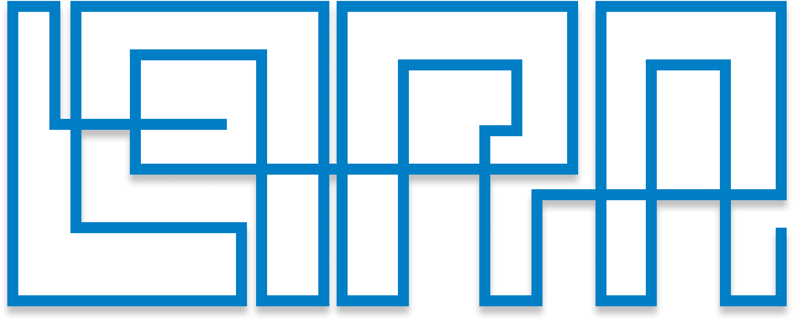

# LARA Core Server - API

<div id='start-of-project'/>
<br>


> **LARA** (**Laboratório em Redes de Aprendizagem**), trata de um **AVA** com o objetivo de ser uma plataforma educacional que relaciona recursos tecnológicos e métodos de ensino  para aprimorar o processo de ensino de disciplinas do curso de Ciência da Computação. 


### Ajustes e melhorias

O projeto ainda está em desenvolvimento e as próximas atualizações serão publicadas assim que forem sendo desenvolvidas
<!--
O projeto ainda está em desenvolvimento e as próximas atualizações serão voltadas nas seguintes tarefas:

- [x] Tarefa 1
- [x] Tarefa 2
- [x] Tarefa 3
- [ ] Tarefa 4
- [ ] Tarefa 5
-->
## 💻 Pré-requisitos

Antes de começar, verifique se você atendeu aos seguintes requisitos:
<!---Estes são apenas requisitos de exemplo. Adicionar, duplicar ou remover conforme necessário--->
* Você instalou a versão mais recente de `<linguagem / dependência / requeridos>`
* Você tem uma máquina `<Windows / Linux / Mac>`. Indique qual sistema operacional é compatível / não compatível.
* Você leu `<guia / link / documentação_relacionada_ao_projeto>`.

## 🚀 Instalando o LARA Core Server

Para instalar o LARA Core Server, siga estas etapas:

Linux e macOS:
```
<comando_de_instalação>
```

Windows:
```
<comando_de_instalação>
```

## ☕ Usando LARA Core Server

Para usar LARA Core Server, siga estas etapas:

```
<exemplo_de_uso>
```

Adicione comandos de execução e exemplos que você acha que os usuários acharão úteis. Fornece uma referência de opções para pontos de bônus!

[⬆ Voltar ao topo](#start-of-project)<br>
